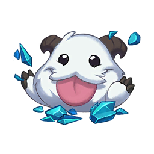

<p align="center">

</p>
<p>
    <h3 align="center">League of ASCII</h3>
    <p align="center">League of Legends CLI Artist</p>
</p>

## Features
### Negative Effect
If you want to create a negative image, you could do the following below:

```go
package main

import (
	"github.com/bloiseleo/leagueofascii/leagueofascii"
	"github.com/bloiseleo/leagueofascii/leagueofascii/helpers"
)

func main() {
	img, err := helpers.ReadJpg("./assets/poro.jpg")
	if err != nil {
		panic(err)
	}
	err = leagueofascii.GenerateNegativeImage(img, "./results/poro_negated.jpg", leagueofascii.Best_Quality)
	if err != nil {
		panic(err)
	}
}
```

## Useful Links
- [What are Premultiplied Alpha colors?](https://shawnhargreaves.com/blog/premultiplied-alpha.html)
- [How to manipulate an image?](https://medium.com/@shubham0473/from-pixels-to-pictures-a-guide-to-image-manipulation-in-java-3647cac29ca3)
